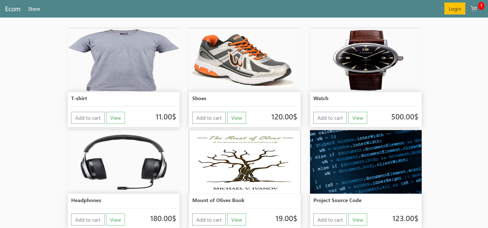
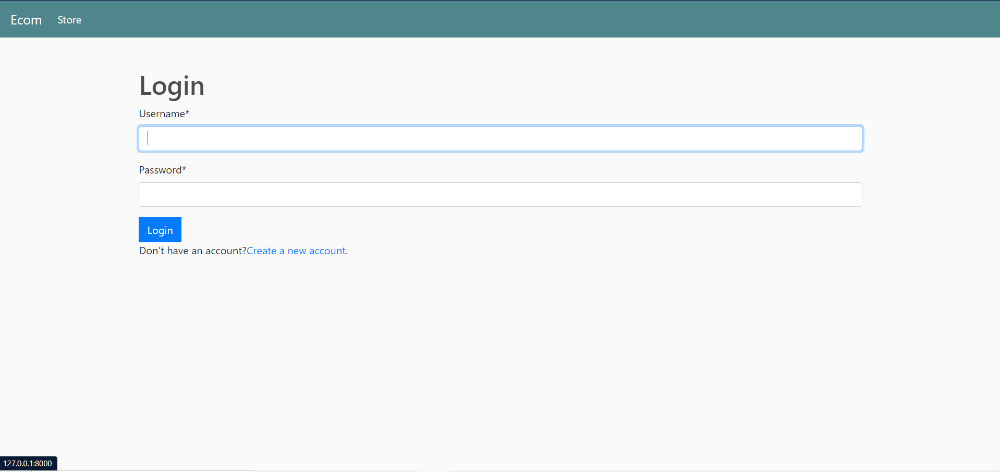
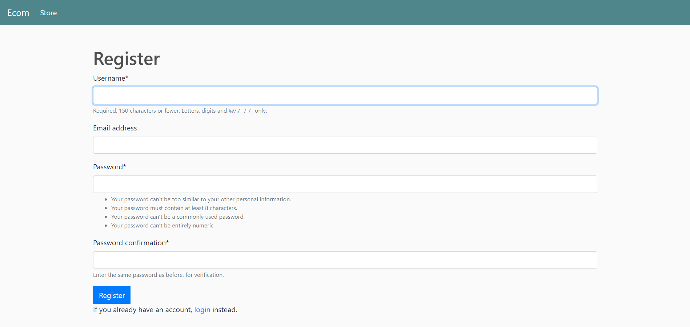
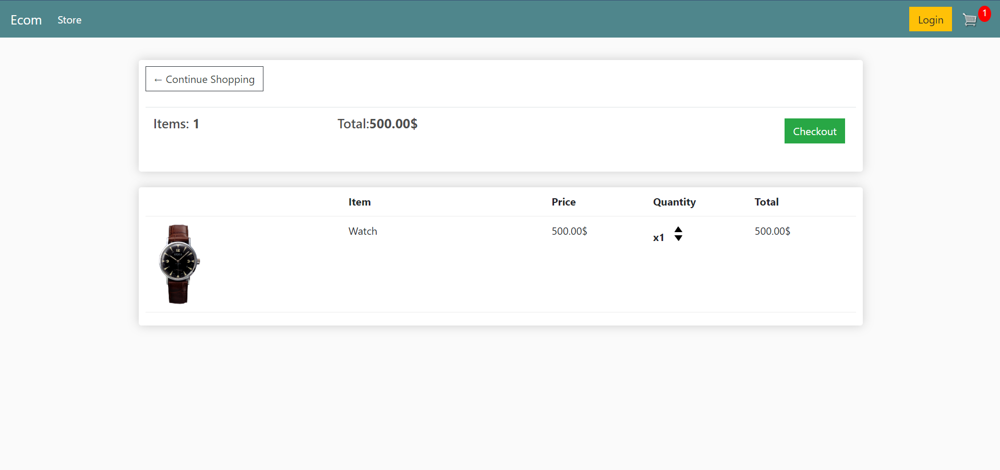
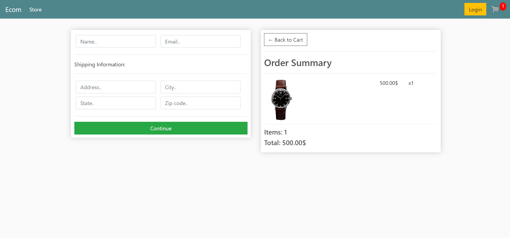

# Ecommerce
This project is built on __pure__ **Django**
## 1.Main page

Here you can add products to the cart. That is possible also for __unlogged__ users.
## 2.Login page

## 3.Register page

## 4.Cart page

## 5.Checkout page

